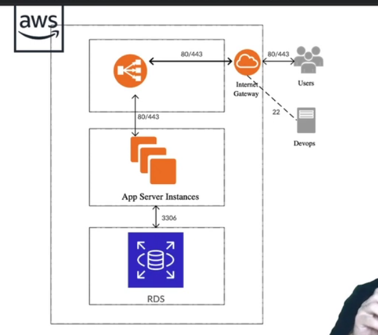

# Amazon Elastic Compute Cloud

- É um serviço que disponibiliza aluguel de máquinas virtuais aws para cloud computing
- Instância EC2
- Free tier

AWS Marketplace

- scripts

## Free tier

- nível gratuito

## Configurando EC2:

- Escolher instância do linux (a menos que o projeto seja específico)
- Escolher o tipo da instância (processamento e ram)
- Escolher o storage (até 30GB é free tier)
- Configurar security group
  - configurar de acordo com o projeto (no caso escolher my ip)
- Após clicar em criar, criar uma chave
- salvar a chave e clicar em connect para conectar com ssh
  - sudo yum update

### Para configurar a rede

- No security group
  - adicionar a policy de liberar protocolos para a mesma rede

### Aws Calculator

- https://calculator.aws/#/estimate

### Máquina Customizada

- Ao criar a máquina, no campo user data colocar o script que deseja executar

```sh
#!/bin/bash
#Atualizando os pacotes
yum update -y
#Configurando os repositórios
amazon-linux-extras install -y lamp-mariadb10.2-php7.2 php7.2
#Instalando o apache e o mysql
yum install -y httpd mariadb-server
#inicialização automática
systemctl start httpd
systemctl enable httpd
systemctl start mariadb
systemctl enable mariadb
#Ajustando o permissionamento
usermod -a -G apache ec2-user
chown -R ec2-user:apache /var/www
```

- netstat -ltun

## EBS - Amazon Elastic Block Store

### IP Elástico

Um Endereço IP elástico é um endereço IPv4 estático projetado para computação em nuvem dinâmica.
Um endereço IP elástico é alocado para a conta da AWS e será seu até que você o libere

- Criar um elastic ip
  - Associar à máquina

## RDS - Relational database service

- Configurar gerar senha de usuário
- configurar security group e acesso à vpc

## VPC (rede virtual) Virtual Private Cloud

## Auto scaling (ELB - Elastic Loading Balance)

Obs: sempre dar um stop na máquina para gerar uma imagem

- preparar a imagem
- gerar a imagem no ambiente



- No ec2 ir em load balance

  - application load balancer (http https)
  - network load balance (por protocolo)

- para funcionar precisa escolhar pelo menos 2 subredes da vpc (ex: a e b)

- target group - para onde o load balancer olha
- health check
- register target

- ir em auto scaling
- auto scaling group

- associar o grupo e não as instâncias

- Scaling Group
  - security group
  - escolher a vpc
    - escolher as subnets
  - group size - começar o auto scale com x maquinas
  - Healthcheck type
    - ec2
    - elb
- Launch Config

- Associar um DNS

- Freenom - registrar domínio gratuito https://www.freenom.com/pt/index.html

- Scaling policy
  - Política de criação de nova instância
    - cpu, ram, etc
  - explorar políticas, testar load balance
