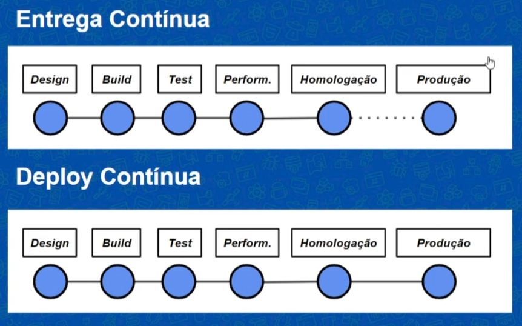
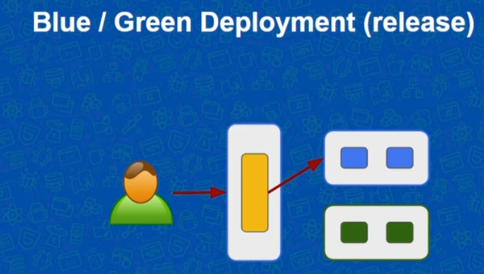

# Entrega Contínua

A publicação de um software deve ser granular, frequente e automatizada.

Anti-Pattern = gerenciamento manual do ambiente

Todos os ambientes devem ser tratados como código, versionados e criados de maneira automatizada.

Entrega contínua x deploy continuo
A entrega contínua para no estágio de homologação e só pode ser integrada ao ambiente de produção após aprovação

Todos os envolvidos são responsáveis pela entrega.

### Princípios da Entrega Contínua

1. Automatizar
2. Versionar
3. Repetir
4. Garantir Qualidade
5. Definição de Pronto
6. Criar um Delivery Team: uma equipe multifuncional, dev, qa, gestor que tem conhecimento da entrega
7. Usar melhoria contínua: cada etapa do pipeline é uma chance de ganhar feedback de melhoria

### Elementos principais da Entrega Contínua

- Cultura Devops
  - feedback, colaboração, confiança
  - melhoria e aprendizagem contínua
- Patterns
  - deployment pipeline
  - deployment patterns(blue/green, canary, feature toggle)
- Arquitetura
  - Solid, Services, 12-Factor App
  - Testability, deployability

### Etapas do pipeline

-Build -> unit tests -> testes de aceitação -> homologação (user acceptance) -> produção

### Boas Práticas

- Manter o pipeline como única forma de deploy
- Manter o pipeline o mais rápido possível
- Realizar build uma única vez, uma versão para o pipeline
- Realizar builds de forma independente do ambiente de deploy
- Ambientes devem ser iguais
- Ambientes devem ser efêmeros (um ambiente deve ser reconfigurado a cada etapa.)

### Commit Stage

- Testes unitários -> devem ser rápidos
- Análise de qualidade de código
- Build
- Todos os scripts devem ser testados
- O código e o ambiente devem estar atualizados

Artefato: Plano de Teste, Relatório de Qualidade, Artefato de Build

### Acceptance Stage

- Especificações - toda a equipe define
- Smoke Test - testar inicialmente as funcionalidades principais
- Mockar sistemas externos
- Seguir os requisitos
- Design e implementação de testes
- O desempenho nesse momento não é o mais importante
- Todo o sistema deve ser testado

### Homolog Stage

- Testes manuais
- Validação do software
- Uso do fluxo desde o início
- Equipe deve participar (feedback)

### Capacity Test Stage

- Estabelecer Metas Claras e saber o baseline
- Usar ferramentas de monitoramento
  - Grafana, Prometheus, Dynatrace
  - Autocannon, Jmeter, Gatling, LoadNinja, Webload, Apache Bench
- Não é obrigatório rodar a todo build, mas é importante ter um ciclo

### Release de Baixo Risco

Antigamente usava-se "carimbos"

- Pre-Alpha (Design)
- Alpha (Commit stage)
- Beta (Acceptance Stage)
- Release Candidate (Homolog + Capacity)
- Release (Production)

Na integração contínua, cada etapa acima está relacionada à um stage, dessa forma, existem algumas técnicas de deploy em produção

#### Blue-Green Deployment

Utilizar dois ambientes, blue e green e chaveá-los após uma release, de forma que um rollback consiste somente de alterar a chave de produção para apontar para o outro.

#### Canary Deployment

Semelhante ao Blue-Green Development, mas a migração em vez de chaveada, é realizada suavemente, disponibilizando o segundo ambiente para uma pequena parte de usuários inicialmente e então aumentando lentamente até que todos os usuários estejam com a nova versão.

#### Feature Toggle

Consiste em uma técnica de chavear novas funcionalidades ao sistema e ativá-las por meio de uma chave liga/desliga.

# References

[Alura](https://cursos.alura.com.br/course/entrega-continua-confiabilidade-qualidade)

[Martin Fowler](https://martinfowler.com/bliki/BlueGreenDeployment.html)

[Martin Fowler](https://martinfowler.com/bliki/CanaryRelease.html)

[Martin Fowler](https://martinfowler.com/bliki/FeatureToggle.html)
