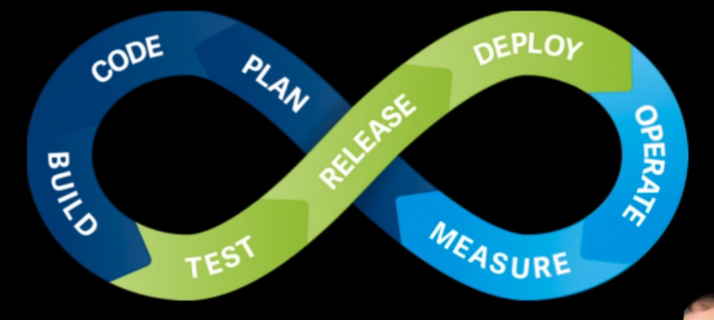

# Integração Contínua

- Build
- Code
- Plan
- Measure
- Operate
- Deploy
- Release
- Test

imagem de https://cursos.alura.com.br/course/pipeline-ci-jenkins-docker/task/57279

## Reação à falhas

## Job free style

## Cron

## build
