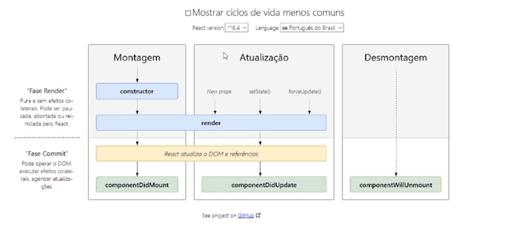

# React

JSX

react -> lib
React -> ecossistema

Adjacent JSX elements must be wrapped in an enclosing tag

- a function App() deve retornar um único elemento pai

## Chaves

- Tudo o que tiver entre chaves é compilado como código javascript

## Lista

- Cada elemento de uma lista deve ter uma key única

## Componentes

# CSS

## ClassName

## Reset CSS

## Conflito

Para evitar conflito de nomes, utilizar nome de classes usando o nome do componente como prefixo, por exemplo.

lista-de-notas
lista-de-notas_header

## Processamento de eventos

- OnChange
- Bind

## Hooks

- setState

### [Regras para usar o hooks](https://pt-br.reactjs.org/docs/hooks-rules.html)

- Uma função não deveria guardar estados
- Você deve usar hooks apenas no nível superior
  - Não usar hooks dentro de loops, funções aninhadas ou condicionais
- Você deve usar hooks dentro de funções e componentes do react
  - Não chamar dentro de funções javascript comum
- Use plugins de eslint para isso: [plugins](https://www.npmjs.com/package/eslint-plugin-react-hooks)

## Props e state

## Ciclo de Vida de um Component React

## SVG

https://fonts.google.com/icons

## Fragment

- usar uma tag vazia que não cria um elemento pai <></>

## Stateful Component

## Stateless Component

# Stop Propagation

# PreventDefault

---

# Ciclo de Vida de um Componente React

https://pt-br.reactjs.org/docs/state-and-lifecycle.html

https://pt-br.reactjs.org/docs/react-component.html#shouldcomponentupdate

- ComponentDidMount
- ComponentWillUnMount
- componentDidUpdate()

1- Não modifique o state corretamente
2- Não use setState no construtor, use no componentDidMount

3- Atualizações de State Podem Ser Assíncronas
4- Atualizações de State São Mescladas
5- Os Dados Fluem para Baixo (um componente pode passar suas props para outro componente filho)

## Use Effect

Se você está familiarizado com os métodos do ciclo de vida do React, você pode pensar no Hook useEffect como componentDidMount, componentDidUpdate, e componentWillUnmount combinados.

## Stepper

- Step, StepLabel, Stepper,
- Criar um componente visual de passos

## OnBlur

## Prop Drilling (má prática)

- Receber propriedades, não fazer nada com elas além de repassar para os componentes filhos

## Contexto

- Criar uma fonte de dados para transmitir para os componentes

- hook useContext

- Provider

## Hooks Customizados

## react router dom

- browser router
- exact path
- Link to

## Hash:

A hash - # within a hyperlink specifies an html element id to which the window should be scrolled.

href="#some-id" would scroll to an element on the current page such as 
.

href="//site.com/#some-id" would go to site.com and scroll to the id on that page.

Scroll to Top:
href="#" doesn't specify an id name, but does have a corresponding location - the top of the page. Clicking an anchor with href="#" will move the scroll position to the top.

## Single Page Application

## Hooks

- UseParams
  - para pegar parametros da url
- useHistory

## Link

- Se não adicionar / antes da rota, ele vai adicionar a rota. ex: categoria/categoria

## Styled Components

## Conteúdos

### Styled componente

### Context e redux

### Next

### Material Ui

- https://mui.com/pt/

### Skeleton

### effects

### docusaurus

## Testing lybrary

- userEvent
  - click
  - type
- queryByText
- getByText
- findByText (aguarda elemento)
- rerender
- waitFor
- waitForElementToBeRemoved
- toBeInDocument
- debug()

# Media Query

## [IMPORTANTE](https://cursos.alura.com.br/course/react-styled-components/task/85175)

Sempre que possível devemos evitar colocarmos a declaração de componentes dentro do método render dentro de componente baseados em classes e no caso de componentes funcionais não devemos declarar um componente dentro do outro.

Isso porque, caso um componente seja declarado dentro do método render ou dentro de um outro componente funcional ele será re-declarado a cada nova renderização e o React não conseguirá fazer cache desse componente, o que pode atrasar e muito a renderização da página.

Por isso, lembre-se de declarar seus componentes e styled components fora dos métodos de renderização do React.

# Theme Provider

# Herança em Styled Components

# [Tests](https://testing-library.com/docs/react-testing-library/intro/)

- render(<App />);
- screen

- expect(screen.getByText('Realizar operação')).toBeInTheDocument();

- @testing-library/react

- Função pura: sempre que passarmos os mesmos parâmetros para ela, ela deve retornar o mesmo resultado

- toMatchSnapshot();

-getByText, getByTestId, getByLabelText

- [Events](https://developer.mozilla.org/pt-BR/docs/Web/Events):
  fireEvent.click
  fireEvent.change
