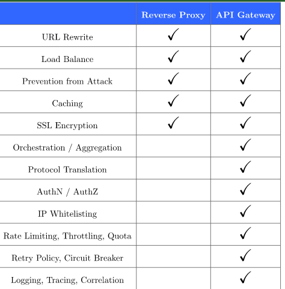

# Padrões de Micro Serviços

## API Gateway

O Gateway de api é uma ferramenta de gerenciamento de APIs que fica entre o cliente e uma coleção de serviços de back-end, servindo como um ponto de entrada. Ele funciona como um proxy inverso, ou um facade, que aceita doas as chamadas de API e agrega os serviços necessários para retornar o resultado esperado.

### Aplicação

Um Gateway de API aceita uma solicitação remota e retorna uma resposta de forma transparente para o cliente. As vantagens dessa abordagens podem ser levantadas como:

- Proteger as APIs do backend da utilização excessivas e abusos, servindo como um serviço de autenticação e limitação de taxa de banda
- Servir como uma ferramenta de monitoramento de análise do uso das diversas apis do backend, permitindo a coleta de diversas métricas
- Facilitar a conexão a um sistema de faturamento, no caso de apis monetizadas
- Em arquitetura de micro-serviços, uma solicitação pode exigir chamada de diversas apis, o Gateway serve para tornar essas chamadas transparentes
- É possível remover ou adicionar novos serviços ao backend de forma transparente para os clientes

Diferenças do api gateway para o reverse proxy

[Fonte](https://www.baeldung.com/cs/api-gateway-vs-reverse-proxy)

# Referências

[Microserviços: Padrões de Projeto](https://cursos.alura.com.br/course/microsservicos-padroes-projeto)

[Redhat - Qual é a função de um gateway de API?](https://www.redhat.com/pt-br/topics/api/what-does-an-api-gateway-do)
