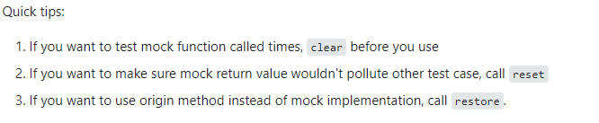
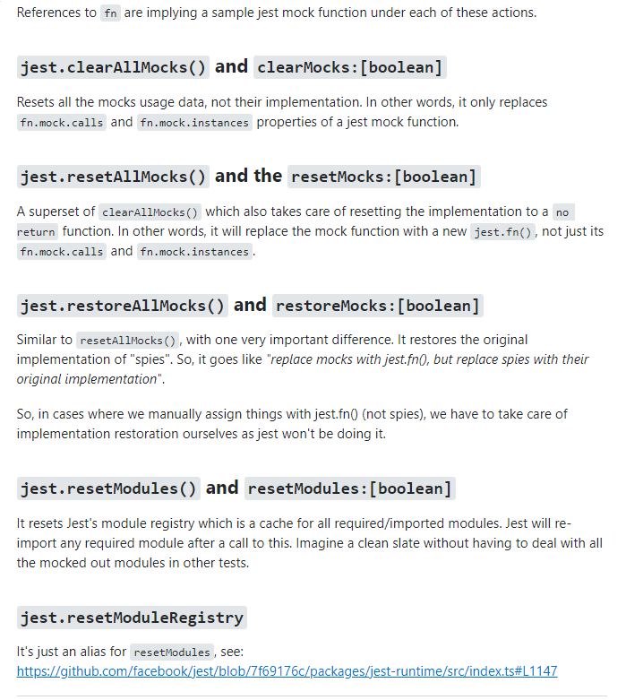

Dynamic Properties: https://www.typescriptlang.org/docs/handbook/release-notes/typescript-1-5.html#computed-properties

https://swaggerstats.io/

https://github.com/goldbergyoni/javascript-testing-best-practices

https://github.com/goldbergyoni/node-chaos-monkey

https://github.com/testjavascript/nodejs-integration-tests-best-practices

https://github.com/animir/node-rate-limiter-flexible

https://github.com/booleanhunter/how-to-build-your-own-uber-for-x-app

https://quickref.me/javascript

https://github.com/goldbergyoni/ui-testing-best-practices

https://stryker-mutator.io/docs/stryker-js/introduction/

https://en.wikipedia.org/wiki/Twelve-Factor_App_methodology

Criar aplicativos desktop com nodejs
https://www.electronjs.org/

Gerenciador de releases do electron

https://github.com/atlassian/nucleus

https://github.com/smeijer/unimported#example

https://github.com/crate-ci/typos

https://github.com/uber/piranha

https://github.com/enlightn/enlightn

https://github.com/ehmicky/cross-platform-node-guide

https://github.com/whyboris/TypeScript-Call-Graph

https://github.com/booleanhunter/how-to-build-your-own-uber-for-x-app

https://swaggerstats.io/

https://github.com/goldbergyoni/javascript-testing-best-practices

https://github.com/goldbergyoni/node-chaos-monkey

https://github.com/pahen/madge

https://github.com/demike/TsUML2

Editor de Readme
https://readme.so/editor

Para tratar soap

https://www.npmjs.com/package/soap
https://www.npmjs.com/package/wsdl-tsclient

Para tratar padrão
https://www.npmjs.com/package/twilio

Diferença entre Rest XML-RPC e SOAP

Sistema integrado de gestão empresarial - ERP

https://example.refine.dev/stores?current=1&pageSize=10
https://docs.nestjs.com/recipes/crud-generator

https://github.com/typestack/class-transformer#plaintoclass

https://www.npmjs.com/package/prisma-class-validator

https://www.npmjs.com/package/class-validator#usage

https://www.npmjs.com/package/class-validator-jsonschema

https://github.com/CyriacBr/class-fixtures-factory

https://github.com/babysor/MockingBird

https://github.com/amplication/amplication

https://github.com/boyney123/mockit

https://www.guru99.com/smoke-testing.html

https://github.com/pagarme/cafe-com-testes/blob/main/artigos/heuristica-vader.md

https://harperdb.io/

https://github.com/danileao/elasticsearch/watchers

https://developer.mozilla.org/pt-BR/docs/Glossary/Hoisting

Mock implementation for the 2nd time

https://stackoverflow.com/questions/64983001/jest-mockimplementationonce-is-not-working-for-2nd-time

https://stackoverflow.com/questions/58151010/difference-between-resetallmocks-resetmodules-resetmoduleregistry-restoreallm

https://node.green/#ES2015

cross-env

https://css-tricks.com/build-great-apps-designer-and-developer-collaboration-just-got-easier/

https://github.com/nativefier/nativefier

https://aws.amazon.com/pt/blogs/architecture/build-a-virtual-waiting-room-with-amazon-dynamodb-and-aws-lambda-at-seatgeek/

https://github.com/caglarturali/caglarturali.github.io

https://codeburst.io/how-i-nailed-a-job-with-this-nodejs-linkedin-bot-6fcada2afbe1

https://github.com/nolanlawson/fuite

https://www.youtube.com/watch?v=u3qGnyPy-pk

https://azsayings.com/kutipan-penulis/kent-beck-30838

https://phenomnomnominal.github.io/betterer/

https://testautomationu.applitools.com/automating-your-api-tests-with-rest-assured/

https://pactumjs.github.io/#/quick-start

https://github.com/canove/whaticket

https://github.com/valerianpereira/backup-action

https://www-freecodecamp-org.cdn.ampproject.org/v/s/www.freecodecamp.org/news/new-free-bootcamps-based-on-freecodecamp-learn-javascript-webdev-with-weekly-live-streams/amp/?amp_gsa=1&amp_js_v=a6&usqp=mq331AQIKAGwASCAAgM%3D#amp_tf=De%20%251%24s&aoh=16383793266473&csi=0&referrer=https%3A%2F%2Fwww.google.com&ampshare=https%3A%2F%2Fwww.freecodecamp.org%2Fnews%2Fnew-free-bootcamps-based-on-freecodecamp-learn-javascript-webdev-with-weekly-live-streams%2F

https://github.com/brunohafonso95/phonecall-poc

https://github.com/jeffijoe/typesync

https://github.com/eykrehbein/strest
https://github.com/eilonmore/linkedin-private-api

https://andersonba.github.io/yve-bot/docs/playground

https://github.com/luizomf/design-patterns-typescript
https://github.com/waldemarnt/http-status-codes

https://github.com/Budibase/budibase

https://dev.to/martinpham/automatic-release-new-version-and-notify-your-followers-about-it-using-github-workflows-3o6m

https://stackoverflow.com/questions/55838798/mocking-moment-and-moment-format-using-jest

https://github.com/tryber/sd-010-a-cookmaster

https://github.com/boyney123/mockit

https://github.com/amplication/amplication

https://github.com/babysor/MockingBird

https://github.com/CyriacBr/class-fixtures-factory

https://www.npmjs.com/package/class-validator-jsonschema

https://www.npmjs.com/package/prisma-class-validator

https://github.com/typestack/class-transformer#plaintoclass

https://dev.to/pankod/build-fast-and-customizable-admin-panel-with-nestjs-291

https://martinfowler.com/bliki/StranglerFigApplication.html

https://github.com/demike/TsUML2

https://microservices.io/patterns/observability/health-check-api.html

https://readme.so/editor

https://github.com/smeijer/unimported#example
